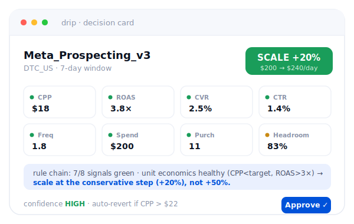

<div align="center">


# Drip

### The open-source growth team for user acquisition.

**One command runs the whole loop** — collect → diagnose → strategize →
create → allocate → learn. Every decision is **rule-based and auditable**;
you keep the wheel. Any LLM, any ad platform, fully self-hostable.

<br/>

[](LICENSE)
[](https://www.python.org/)
[](https://github.com/YunyueLi/Drip/releases)
[](https://github.com/YunyueLi/Drip/actions)
[](tests/)
[](https://github.com/YunyueLi/Drip/stargazers)

[**▶ Live console**](https://yunyueli.github.io/Drip/app.html) · [**Quickstart**](#-quickstart) · [**How it works**](#-how-it-works) · [**Drip-Bench**](#-drip-bench) · [**vs. closed-source**](#-open-vs-closed) · [**Roadmap**](#%EF%B8%8F-roadmap)

**English** · [简体中文](README.zh-CN.md)

</div>

<div align="center">

<a href="https://yunyueli.github.io/Drip/app.html"></a>

<sub>Every campaign scored on **8 signals** → rules decide → an auditable card with the **"why"**. You approve before any spend. **[▶ Open the live console →](https://yunyueli.github.io/Drip/app.html)** · 10 languages</sub>

</div>

---

> Performance teams now have a wave of AI agents — Sett, Kohort, GrowthGPT,
> Meta GEM. They all do roughly the same thing, and they all share one problem:
> **they won't tell you _why_.** Closed pricing, hidden LLM, hidden rules,
> hidden prompts, your data on their servers, and "70% lower CPA" claims with
> no published cases.
>
> **Drip is the open answer** — the whole UA loop as a team of agents you can
> read, run, fork, and self-host. The decision core is **deterministic and
> auditable**; the LLM only narrates. Trust it because you can _check_ it.

```console
$ drip run --budget 1000

  one-stop run · 2026-05-21 → 2026-05-28 · budget $1,000

  ▸ diagnosis   Scanned 4 campaigns, $880 spend. Decisions: 2 SCALE, 2 PAUSE.
  ▸ strategy    [scale] Meta_Prospecting_v3 — 3 variants on the winning hook
                [cut]   TikTok_Broad_v1     — test a fresh angle
  ▸ creative    3 variants produced
  ▸ allocation  meta   Meta_Prospecting_v3    SCALE  →  $500
                tiktok TikTok_Prospecting_v3  SCALE  →  $500
                meta   Meta_Broad_v1          PAUSE  →  $0
  ▸ feedback    winner CTR 1.40% is the bar for the next creatives
```

<div align="center"><sub>Runs offline on samples out of the box. Plug credentials + an LLM to go live — the decision engine never changes.</sub></div>

---

## ✨ What Drip does

A full growth team, six roles, one loop, one command:

| Step | Agent | What it does | Powered by |
|---|---|---|---|
| 1 · **Collect** | `collectors` | Pull cross-platform insights, normalise to one schema | Meta / TikTok SDK · offline sample |
| 2 · **Diagnose** | `analyst` | Score each campaign, scan anomalies, write the report | Decision engine + LLM |
| 3 · **Strategize** | `strategist` | Rank winners/losers, propose the next creative test | LLM |
| 4 · **Create** | `creative` | Produce ad variants for the winning direction | gpt-image / Seedance / ComfyUI |
| 5 · **Allocate** | `allocator` | Reallocate budget across platforms — fund winners, starve losers | Decision engine |
| 6 · **Learn** | `feedback` | Distil what won, feed it back to the next cycle | — |

Plus **`attribution`** (reconcile platform-reported vs MMP truth) and the
**8-signal decision engine** that every scale/pause call runs through.

> **The point:** the action is computed by **rules over 8 signals** —
> deterministic, explainable, replayable. The LLM only writes the human "why".
> That's what lets you trust it with real money.

---

## 🖥️ The console

One chat-driven control room for the whole loop — diagnose, decide, allocate, create, and prove it. It's not a black box: every decision opens its **8-signal vector + rule chain + replay** in the side panel, so you see exactly _why_ before you approve.

- **Decisions queue** — scale / refresh / pause, each opening its **8-signal vector + rule chain + confidence**. Approve in one click.
- **Allocation** — budget freed from losers flows to winners, across platforms, within your daily cap.
- **Strategy** — a consulting-grade growth plan: personas, competitive matrix, budget split, each with its rationale.
- **Drip-Bench** — the open, reproducible leaderboard for UA-agent decisions.

The screenshots age fast, the live console doesn't — see it for real:

<div align="center"><b><a href="https://yunyueli.github.io/Drip/app.html">▶ Open the live console — no install →</a></b></div>

---

## 🧠 How it works

```
                         drip run  /  LangGraph daemon
                                    │
   ┌──────────────────────── the one-stop loop ───────────────────────┐
   │                                                                   │
   ▼                                                                   │
 Collect ─▶ Diagnose ─▶ Strategize ─▶ Create ─▶ Allocate ─▶ Learn ─────┘
   │           │                                    │          (feeds next cycle)
   │           ▼                                    ▼
   │   ┌─────────────────────┐            human approval gate
   │   │  Decision Engine    │            (before any spend)
   │   │  8 signals → rules  │
   │   │  → card + "why"     │   ◀── deterministic core; LLM only narrates
   │   └─────────────────────┘
   ▼
 AdMetrics  ◀── one cross-platform data contract every agent speaks
   │
   └─▶ Slots (swap any):  LLM ·  bidding ·  LTV ·  creative gen ·  ads write
```

A campaign's metrics hit **8 signals** (CPP, ROAS, CVR, CTR, frequency, spend,
purchases, headroom) → each goes GREEN/YELLOW/RED → **rules** produce a
`SCALE / PAUSE / HOLD / REDUCE / REFRESH` decision with confidence, guardrails,
and an auditable rule chain. Thin sample? It scales conservatively and caps
confidence — the same judgment a senior buyer makes.

Full design: [`docs/architecture.md`](docs/architecture.md) ·
[`docs/vision.md`](docs/vision.md) · platform-capability research and the
real-time-control design in [`docs/intraday-research.md`](docs/intraday-research.md).

---

## ⚙️ It executes, too — safely

The loop doesn't stop at a plan. Three commands push it to the platforms, behind the same money-safety ladder:

- **`drip apply`** — write the scale / pause / budget decisions to **Meta · 腾讯 · 巨量 · 快手** (auto-routed per platform). Each write snapshots the old value, re-reads to verify, and lands in an audit trail.
- **`drip watch`** — the intraday **spend-side** guard: hourly pacing / cost-spike / anti-overspend — throttle or pause before the budget runs away.
- **`drip autopilot`** — the whole loop, **signal-routed** (bleeding → stop-loss first, then scale / refresh / allocate) behind a **circuit breaker** that halts on a data anomaly or write failures.

Every write obeys `DRIP_BUDGET_CAP` + `DRIP_MAX_CHANGE_PCT` (no learning-phase-resetting jumps) and `DRIP_MODE` — **shadow** (plan only) → **copilot** (approve each) → **autonomous** (within caps). No platform token → it stays shadow, so it's safe to run anywhere.

---

## ⚡ Quickstart

**Requires** Python **3.11** ([`uv`](https://docs.astral.sh/uv/) recommended).

```bash
git clone https://github.com/YunyueLi/Drip.git && cd Drip
uv venv -p 3.11 && source .venv/bin/activate
uv pip install -e ".[dev]"

drip run                       # the whole loop, end to end (offline samples)
drip doctor                    # diagnose one account → decision cards
drip apply                     # collect → decide → PUSH to Meta/腾讯/巨量/快手 (shadow default)
drip watch --once              # intraday spend-side guard: pacing / cost-spike / overspend
drip autopilot                 # the whole loop, signal-routed + circuit-broken (shadow default)
drip bench run --agent claude  # score any agent on 10 UA decisions
drip llm                       # 12 model providers, addressed as provider/model
```

Go live: set `ANTHROPIC_API_KEY` + a Meta System User token, `uv pip install -e
".[all]"`, then `drip apply --mode copilot` — Drip pulls real data, shows each
scale/pause with its **why**, and writes only the ones you approve (capped by
`DRIP_BUDGET_CAP` + `DRIP_MAX_CHANGE_PCT`, every write audited). Spend stays in
**shadow** until you choose `copilot`/`autonomous`. Full path: [`docs/deploy.md`](docs/deploy.md).

---

## 🧩 The agents

Each is a small, framework-agnostic module you can read in one sitting:

```
src/drip/
  collectors.py    pull data — Meta · TikTok · 腾讯 · 巨量 · 快手 (+ offline sample)
  analyst.py       diagnose + anomaly scan + report
  strategist.py    next creative test from performance
  creative.py      produce variants (orchestrate external generators)
  allocator.py     cross-platform budget allocation
  attribution.py   reconcile platform-reported vs MMP truth
  feedback.py      learnings → next cycle
  engine/          decision core: signals → rules → cards · intraday spend-side
  adapters/        ad writers (Meta + 腾讯/巨量/快手) · creative gen · bidding · LTV
  safety.py        budget + learning-phase guards · append-only audit trail
  supervisor.py    signal-driven autonomous orchestration (route + circuit breaker)
  pipeline.py      the one-stop loop      graph.py  LangGraph production daemon
  llm/             12-provider LLM layer  eval/     Drip-Bench
```

---

## 🔌 Bring your own everything

Drip builds the orchestration, the judgment, and the evaluation. Every
"can't-win / no-data" hard part is a **swappable slot** with an offline
fallback — nothing locks you in.

| Slot | Plug in | Default (offline) |
|---|---|---|
| **LLM** | Claude · GPT · Gemini · Qwen · DeepSeek · Grok · local… (12 + OpenRouter fallback) | template (no key) |
| **Creative gen** | gpt-image · Seedance · ComfyUI · Arcads | dry placeholders |
| **Ad-platform writes** | Meta Marketing API · 腾讯 / 巨量 / 快手 REST | shadow until copilot/autonomous |
| **LTV / value** | Kohort · Voyantis · your model | heuristic |
| **Attribution truth** | AppsFlyer · Adjust | documented haircut |

---

## 📊 Drip-Bench

The first **open, reproducible** benchmark for UA agent decisions. 10
hand-curated cases (scale, pause, reallocate, fatigue, anomaly, cohort,
audience, bid-strategy, market-entry, crisis), a three-part rubric
(action 40 / direction 20 / reasoning 40), and a pluggable agent interface.

```bash
drip bench run --agent drip:openai/gpt-4o   # any provider/model
drip bench run --agent claude               # vs raw Claude
```

Every run writes a reproducible bundle. Ship a UA agent? Run it against
Drip-Bench and PR the result — win or lose. We publish ours too.
See [`benchmarks/`](benchmarks/).

---

## 🆚 Open vs. closed

| | Sett · Kohort · GrowthGPT | **Drip** |
|---|---|---|
| Code | Closed | **Apache-2.0** |
| Decision logic | Black box | **Read it in `src/drip/`** |
| Why a decision happened | "Trust us" | **Signal vector + rule chain + replay** |
| LLM | Vendor-locked | **Any of 12 + local** |
| Cross-platform | Per walled garden | **Neutral, optimises across** |
| Data | Their servers | **Yours** |
| Evaluation | Marketing claims | **Drip-Bench, reproducible** |
| Price | $99–$999+/mo | **Free · self-host** |

We don't claim Drip beats them on raw performance today. We claim it's the only
one you can **audit, fork, and run in your own environment** — and the only one
whose evaluation is reproducible.

---

## 🛟 Safe by default

Money safety is a ladder, not a switch (`DRIP_MODE`):

- **`shadow`** (default) — plan only, never writes to a platform
- **`copilot`** — every write waits for human approval
- **`autonomous`** — writes up to `DRIP_BUDGET_CAP`, checked before start

The LangGraph daemon adds an **interrupt-before-spend** gate — a human signs
off the budget move, then the run resumes from its checkpoint. Accountability
stays with a person; execution scales toward lights-out.

---

## 🗺️ Roadmap

The roadmap is **bench-driven** — every release publishes its Drip-Bench score.

- [x] 8-signal decision engine · 12-provider LLM layer · bid/value slots
- [x] **7 agents + end-to-end one-stop pipeline** · `drip run`
- [x] Drip-Bench v0 (10 cases) · LangGraph production graph
- [x] **Chat-driven console** (10 languages) + platform-capability research ([`docs/intraday-research.md`](docs/intraday-research.md))
- [x] **Meta write path** — `drip apply` pushes scale/pause to live campaigns (copilot approval · budget + learning-phase guards · audited)
- [ ] First live Meta write **verified on a real account** (plug your token, `drip apply --mode copilot`)
- [x] **Intraday spend-side layer** — `drip watch`: hourly pacing / cost-spike / anti-overspend (gated + audited)
- [ ] Public Drip-Bench leaderboard with baseline scores
- [x] **Autonomous orchestration** — `drip autopilot`: signal-driven supervisor (route + circuit breaker), deterministic & auditable
- [x] **China-platform writers** — 腾讯 / 巨量 / 快手, routed by `drip apply` + `drip watch` (gated + audited; live verify pending creds)
- [ ] Knowledge Packs — vertical signal/prompt overrides (anime, DTC, app…)

Build log: [@drip_agent](https://x.com/drip_agent) · [CHANGELOG](CHANGELOG.md).

---

## 🤝 Contributing

The highest-leverage contributions right now:

1. **Run Drip-Bench** against any agent — yours, ours, a competitor's — and PR the bundle.
2. **Add a benchmark case** ([`benchmarks/SCHEMA.md`](benchmarks/SCHEMA.md)) — needs ≥3 reviewer sign-offs and must discriminate.
3. **Knowledge Packs** — YAML-only vertical baselines/prompts, no Python required.
4. **Provider adapters** — Apple Search Ads, 巨量引擎, 腾讯广告, 快手. ~150-line PRs.

Setup in [CONTRIBUTING.md](CONTRIBUTING.md). PRs pass `ruff check .`, `mypy src`, `pytest`.

---

## 🙏 Acknowledgements

Built on [Anthropic Claude Agent SDK](https://github.com/anthropics/claude-agent-sdk-python),
[LangGraph](https://github.com/langchain-ai/langgraph),
[CAMEL-AI OASIS](https://github.com/camel-ai/oasis),
[PyMC-Marketing](https://github.com/pymc-labs/pymc-marketing),
[meta-ads-mcp](https://github.com/pipeboard-co/meta-ads-mcp).
Prior art that proved the niche: [Sett](https://www.sett.ai/),
[Kohort](https://www.kohort.ai/), [GrowthGPT](https://growthgpt.app/).

---

## 📜 License

[Apache 2.0](LICENSE) — use it, fork it, ship it.

<div align="center">
<br/>


**Drip** · built in the open by [@YunyueLi](https://github.com/YunyueLi)

If Drip saves you a week — or the industry one more unverifiable benchmark claim — give it a ⭐

</div>
