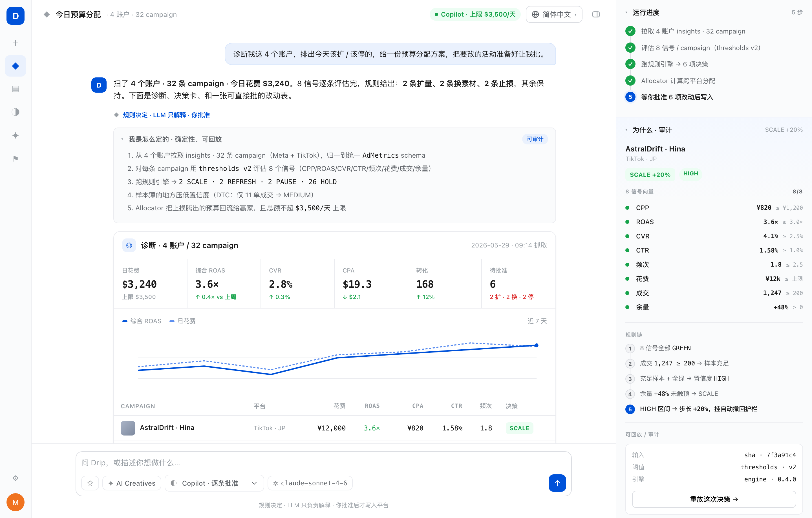

<div align="center">


# Drip

### 用户增长的开源 AI 团队。

**一条命令跑完整个循环** —— 收数据 → 诊断 → 策略 → 素材 → 分钱 → 复盘。
每个决定都基于规则、**可审计**;方向盘始终在你手里。任意 LLM、任意广告平台、完全可自托管。

<br/>

[](LICENSE)
[](https://www.python.org/)
[](https://github.com/YunyueLi/Drip/actions)
[](tests/)
[](https://github.com/YunyueLi/Drip/stargazers)
[](https://x.com/drip_agent)

[**快速开始**](#-快速开始) · [**工作原理**](#-工作原理) · [**agent 团队**](#-agent-团队) · [**开源 vs 闭源**](#-开源-vs-闭源) · [**路线图**](#%EF%B8%8F-路线图) · [**愿景**](docs/vision.md)

[English](README.md) · **简体中文**

</div>

<div align="center">

<a href="https://yunyueli.github.io/Drip/app.html"></a>

<sub>每条 campaign 跑 **8 信号** · 规则决定、LLM 只解释 · 动钱前先过你这关 · **[▶ 在线演示](https://yunyueli.github.io/Drip/app.html)** · 10 种语言</sub>

</div>

---

> 性能营销团队现在有一堆 AI agent 可选 —— Sett、Kohort、GrowthGPT、Meta GEM。
> 它们干的事大同小异,也有同一个问题:**不告诉你「为什么」。** 定价不透明、
> 用什么 LLM 看不见、规则看不见、prompt 看不见、数据在他们服务器,而"CPA 降 70%"
> 的宣传背后没有一个可公开的 case。
>
> **Drip 是另一条路** —— 把整个 UA 循环做成一群可读、可跑、可 fork、可自托管的
> agent。决策核心是确定性的、可审计的;LLM 只负责解释。

```console
$ drip run --budget 1000

  一站式跑完一圈 · 2026-05-21 → 2026-05-28 · 预算 $1,000

  ▸ 诊断    扫描 4 个 campaign,花费 $880。决策:2 SCALE,2 PAUSE。
  ▸ 策略    [扩] Meta_Prospecting_v3 — 在赢家钩子上出 3 个变体
            [砍] TikTok_Broad_v1     — 换个新角度测
  ▸ 素材    产出 3 个变体
  ▸ 分配    meta   Meta_Prospecting_v3    SCALE  →  $500
            meta   Meta_Broad_v1          PAUSE  →  $0
            tiktok TikTok_Prospecting_v3  SCALE  →  $500
            tiktok TikTok_Broad_v1        PAUSE  →  $0
  ▸ 复盘    赢家 CTR 1.40% 是下一轮素材的标杆
```

<div align="center"><sub>开箱即用、本机样本即可跑。配上凭证 + LLM 就能上生产——代码一行不改。</sub></div>

---

## ✨ Drip 做什么

一支完整的 AI 增长团队,六个角色,一个循环,一条命令:

| 步骤 | Agent | 做什么 | 由谁驱动 |
|---|---|---|---|
| 1 · **收数据** | `collectors` | 拉跨平台数据,归一化成一套 schema | Meta / TikTok SDK |
| 2 · **诊断** | `analyst` | 给每个 campaign 打分、扫异常、写报告 | 决策引擎 + LLM |
| 3 · **策略** | `strategist` | 排赢家/输家,提出下一轮该测什么 | LLM |
| 4 · **素材** | `creative` | 给赢家方向出广告变体 | gpt-image / Seedance / ComfyUI |
| 5 · **分钱** | `allocator` | 跨平台重分预算——喂赢家、饿输家 | 决策引擎 |
| 6 · **复盘** | `feedback` | 提炼赢的特征,喂回下一轮 | — |

外加 **`attribution`**(对账:平台自报 vs MMP 真相)和每个 scale/pause 都要走的
**8-signal 决策引擎**。

> **核心:** 决定是由 **8 个信号上的规则**算出来的——确定、可解释、可复现。
> LLM 只写人话的"为什么"。这才是你敢把真金白银交给它的原因。

---

## 🧠 工作原理

```
                         drip run  /  LangGraph 守护进程
                                    │
   ┌──────────────────────── 一站式循环 ────────────────────────┐
   │                                                            │
   ▼                                                            │
 收数据 ─▶ 诊断 ─▶ 策略 ─▶ 素材 ─▶ 分钱 ─▶ 复盘 ──────────────────┘
   │        │                       │        (喂回下一轮)
   │        ▼                       ▼
   │  ┌──────────────────┐    花钱前人工审批关卡
   │  │   决策引擎        │
   │  │  8 信号 → 规则    │
   │  │  → 卡片 + "为什么"│   ◀── 确定性核心;LLM 只解释
   │  └──────────────────┘
   ▼
 AdMetrics  ◀── 每个 agent 都说的同一套跨平台数据契约
   │
   └─▶ 插槽(任意可换): LLM · 出价 · LTV · 素材生成 · 投放
```

一个 campaign 的指标过 **8 个信号**(CPP、ROAS、CVR、CTR、频次、花费、转化数、
预算余量)→ 各判 绿/黄/红 → **规则**给出 `SCALE / PAUSE / HOLD / REDUCE / REFRESH`
决策 + 信心等级 + 护栏 + 可审计的规则链。样本不够厚?它会保守扩量并下调信心——
跟资深操盘手一个判断。

完整设计:[`docs/architecture.md`](docs/architecture.md) ·
[`docs/vision.md`](docs/vision.md)。

---

## ⚡ 快速开始

**需要** Python **3.11**(推荐 [`uv`](https://docs.astral.sh/uv/))。

```bash
git clone https://github.com/YunyueLi/Drip.git && cd Drip
uv venv -p 3.11 && source .venv/bin/activate
uv pip install -e ".[dev]"

drip run                       # 整个循环,端到端(本机样本)
drip doctor                    # 诊断单个账户 → 决策卡
drip bench run --agent claude  # 用 10 道 UA 决策题给任意 agent 打分
drip llm                       # 12 家模型,用 provider/model 寻址
```

上生产(代码不改):配 `ANTHROPIC_API_KEY` + Meta System User token,
`uv pip install -e ".[all]"`,再 `drip run --narrate anthropic/claude-sonnet-4-6`。
完整路径:[`docs/deploy.md`](docs/deploy.md)。

---

## 🧩 agent 团队

每个都是能一口气读完的、框架无关的小模块:

```
src/drip/
  collectors.py    收数据(Meta/TikTok SDK + 本机样本)
  analyst.py       诊断 + 异常扫描 + 报告
  strategist.py    从绩效反推下一轮该测什么
  creative.py      出变体(编排外部生成工具)
  allocator.py     跨平台预算分配
  attribution.py   对账:平台自报 vs MMP 真相
  feedback.py      学到的东西 → 喂回下一轮
  engine/          决策核心:signals → rules → cards
  pipeline.py      一站式循环         graph.py  LangGraph 生产守护进程
  llm/             12 家 LLM 统一层   eval/     Drip-Bench
```

---

## 🔌 任意可换

Drip 自己造编排、判断、评测。每个"打不过 / 没数据"的硬零件都是**可换插槽** +
本机兜底——绝不锁死你。

| 插槽 | 接什么 | 默认(本机) |
|---|---|---|
| **LLM** | Claude · GPT · Gemini · Qwen · DeepSeek · Grok · 本地…(12 家 + OpenRouter 兜底) | 真跑报告时需配 |
| **素材生成** | gpt-image · Seedance · ComfyUI · Arcads | dry 占位 |
| **出价执行** | Meta Advantage+ · AppLovin AXON · Madgicx | shadow(只记账) |
| **LTV / 价值** | Kohort · Voyantis · 你自己的模型 | 启发式 |
| **归因真相** | AppsFlyer · Adjust | 带文档的 haircut 估算 |

---

## 📊 Drip-Bench

第一个**开放、可复现**的 UA agent 决策评测集。10 道精选 case(扩量、止损、
重分配、素材疲劳、异常、cohort、受众、出价策略、开新市场、危机),三段式打分
(选项 40 / 方向 20 / 推理 40),可插拔 agent 接口。

```bash
drip bench run --agent drip:openai/gpt-4o   # 任意 provider/model
drip bench run --agent claude               # 对比裸 Claude
```

每次 run 写一份可复现 bundle。你也做 UA agent?拿它跑 Drip-Bench、把结果提 PR——
不管输赢。我们也公开自己的。详见 [`benchmarks/`](benchmarks/)。

---

## 🆚 开源 vs 闭源

| | Sett · Kohort · GrowthGPT | **Drip** |
|---|---|---|
| 代码 | 闭源 | **Apache-2.0** |
| 决策逻辑 | 黑盒 | **`src/drip/` 里直接读** |
| 为什么这么决定 | "相信我们" | **信号向量 + 规则链 + 可复现** |
| LLM | 厂商锁定 | **12 家任选 + 本地** |
| 跨平台 | 各自围墙花园 | **中立,跨平台优化** |
| 数据 | 他们服务器 | **你的** |
| 评测 | 宣传话术 | **Drip-Bench,可复现** |
| 价格 | $99–$999+/月 | **免费 · 自托管** |

我们不说 Drip 今天能跑赢它们的真实指标。我们说:它是唯一一个你能**审查、fork、
在自己环境跑**的,也是唯一一个**评测可复现**的。

---

## 🛟 默认安全

花钱安全是一道阶梯,不是开关(`DRIP_MODE`):

- **`shadow`**(默认)—— 只规划,绝不写入平台
- **`copilot`** —— 每次写入都等人工批准
- **`autonomous`** —— 在 `DRIP_BUDGET_CAP` 内自动写,上限开跑前就 check

LangGraph 守护进程还加了**花钱前 interrupt 关卡**——人签字批准预算变动,然后从
断点续跑。问责始终在人身上,执行趋近 lights-out。

---

## 🗺️ 路线图

路线图是 **bench-driven** 的——每个版本都公开自己的 Drip-Bench 分数。

- [x] 8-signal 决策引擎 · 12 家 LLM 层 · 出价/价值插槽
- [x] **7 个 agent + 端到端一站式 pipeline** · `drip run`
- [x] Drip-Bench v0(10 题)· LangGraph 生产图 · 15/15 测试
- [ ] 公开 Drip-Bench leaderboard + 基线分数
- [ ] 第一次真实 Meta/TikTok 凭证投放(copilot 模式)
- [ ] Knowledge Packs —— 行业信号/prompt 覆盖(二次元、DTC、App…)
- [ ] Trace Inspector(web)· `drip.cloud` 托管(同代码)· 50 题 bench

build log:[@drip_agent](https://x.com/drip_agent)。

---

## 🤝 贡献

现在最高杠杆的贡献:

1. **拿任意 agent 跑 Drip-Bench**——你的、我们的、竞品的——把 bundle 提 PR。
2. **加一道 case**([`benchmarks/SCHEMA.md`](benchmarks/SCHEMA.md))—— 需 ≥3 个评审 +1,且要有区分度。
3. **Knowledge Packs** —— 纯 YAML 的行业 baseline/prompt,不写 Python。
4. **平台适配器** —— Apple Search Ads、Pangle、巨量引擎,约 150 行 PR。

环境准备见 [CONTRIBUTING.md](CONTRIBUTING.md)。PR 要过 `ruff check .`、`mypy src`、`pytest`。

---

## 🙏 致谢

基于 [Anthropic Claude Agent SDK](https://github.com/anthropics/claude-agent-sdk-python)、
[LangGraph](https://github.com/langchain-ai/langgraph)、
[CAMEL-AI OASIS](https://github.com/camel-ai/oasis)、
[PyMC-Marketing](https://github.com/pymc-labs/pymc-marketing)、
[meta-ads-mcp](https://github.com/pipeboard-co/meta-ads-mcp)。
证明这个赛道值得做的前辈:[Sett](https://www.sett.ai/)、
[Kohort](https://www.kohort.ai/)、[GrowthGPT](https://growthgpt.app/)。

---

## 📜 License

[Apache 2.0](LICENSE) —— 用它、fork 它、发它。

<div align="center">
<br/>

**Drip** · 由 [@YunyueLi](https://github.com/YunyueLi) 在开源世界搭建

如果 Drip 替你省了一周,或帮这个行业少一个无法验证的宣传数字,给个 ⭐

</div>
